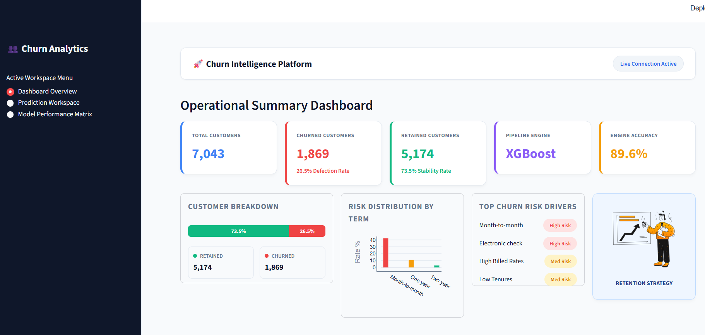
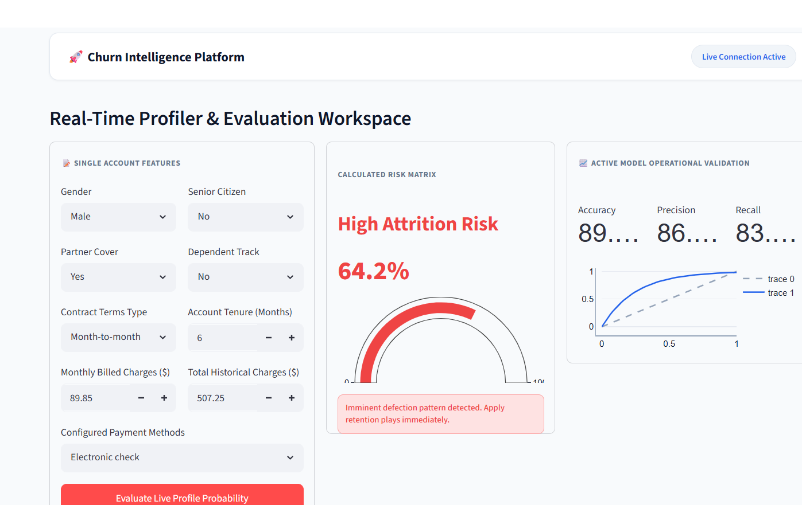
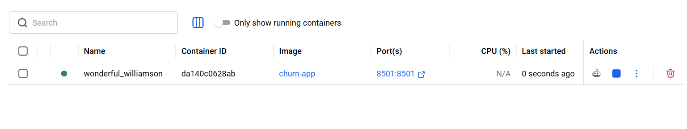
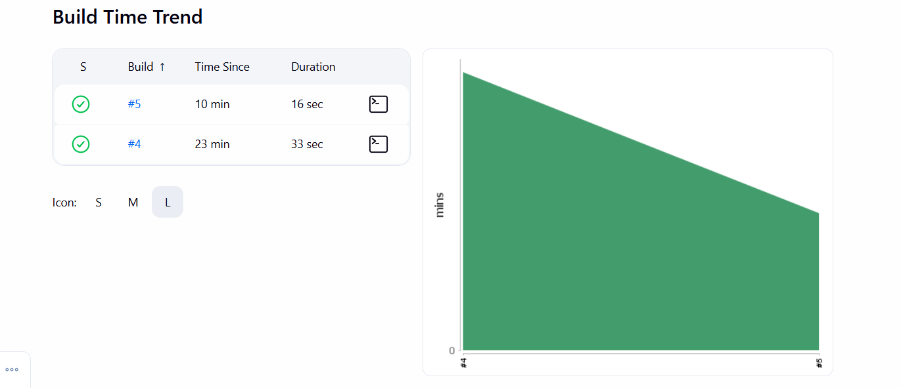
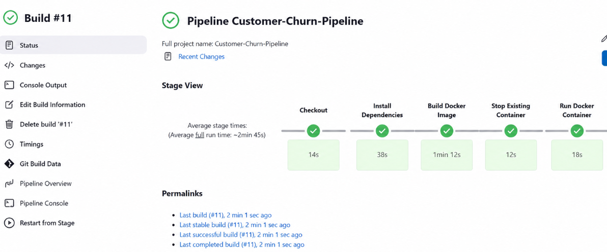

# 🚀 Customer Churn Prediction using Machine Learning


---

# 📌 Project Overview

Customer Churn Prediction is an end-to-end Machine Learning project that predicts whether a telecom customer is likely to churn based on customer demographics, account information, and subscribed services.

This project demonstrates the complete machine learning lifecycle, including:

- Data preprocessing
- Exploratory Data Analysis (EDA)
- Feature engineering
- Model training
- Model evaluation
- Streamlit web application
- Docker containerization
- Jenkins CI/CD pipeline
- GitHub version control

---

# ✨ Features

- Predict customer churn using Machine Learning
- Interactive Streamlit web application
- Data preprocessing pipeline
- Feature encoding and scaling
- Model serialization using Pickle
- Dockerized deployment
- Jenkins CI/CD automation
- GitHub integration

---

# 🛠 Tech Stack

## Programming Language

- Python

## Machine Learning

- Scikit-learn
- Pandas
- NumPy

## Data Visualization

- Matplotlib
- Seaborn

## Web Framework

- Streamlit

## DevOps

- Docker
- Jenkins
- Git
- GitHub

---

# 📂 Project Structure

```text
Customer-Churn-Prediction
│
├── app/
├── data/
├── models/
├── notebooks/
├── screenshots/
│   ├── home.png
│   ├── prediction.png
│   ├── docker.png
│   ├── jenkins.png
│   └── pipeline.png
│
├── src/
├── .streamlit/
├── Dockerfile
├── Jenkinsfile
├── requirements.txt
├── README.md
└── .gitignore
```

---

# 📸 Project Screenshots

## 🏠 Streamlit Home Page



---

## 📊 Customer Churn Prediction



---

## 🐳 Docker Container

The application is successfully containerized using Docker.



---

## ⚙️ Jenkins Build Success

Successful CI/CD pipeline execution using Jenkins.



---

## 🚀 Pipeline Overview

Pipeline stages executed successfully.



---

# 🏗 Project Architecture

```text
               Developer
                   │
                   ▼
               VS Code
                   │
             git commit
                   │
             git push
                   │
                   ▼
                GitHub
                   │
                   ▼
                Jenkins
                   │
      ┌────────────┴────────────┐
      ▼                         ▼
Checkout Source          Install Dependencies
      │                         │
      └────────────┬────────────┘
                   ▼
          Build Docker Image
                   │
                   ▼
     Stop Existing Container
                   │
                   ▼
        Run Docker Container
                   │
                   ▼
       Streamlit Web Application
                   │
                   ▼
      Customer Churn Prediction
```

---

# 🤖 Machine Learning Workflow

- Data Collection
- Data Cleaning
- Exploratory Data Analysis
- Feature Engineering
- Data Preprocessing
- Model Training
- Model Evaluation
- Model Serialization
- Streamlit Deployment
- Docker Containerization
- Jenkins CI/CD

---

# 📈 Model Features

The model uses customer information including:

- Gender
- Senior Citizen
- Partner
- Dependents
- Tenure
- Phone Service
- Multiple Lines
- Internet Service
- Online Security
- Online Backup
- Device Protection
- Tech Support
- Streaming TV
- Streaming Movies
- Contract Type
- Paperless Billing
- Payment Method
- Monthly Charges
- Total Charges

---

# 🚀 Installation

Clone the repository

```bash
git clone https://github.com/sanjanahp16/Customer-Churn-Prediction.git
```

Navigate into the project

```bash
cd Customer-Churn-Prediction
```

Install dependencies

```bash
pip install -r requirements.txt
```

Run the Streamlit application

```bash
streamlit run app/app.py
```

Open your browser

```
http://localhost:8501
```

---

# 🐳 Docker Deployment

Build Docker Image

```bash
docker build -t customer-churn-app .
```

Run Docker Container

```bash
docker run -d -p 8501:8501 --name customer-churn customer-churn-app
```

Verify running containers

```bash
docker ps
```

Application URL

```
http://localhost:8501
```

---

# ⚙️ Jenkins CI/CD Pipeline

Pipeline Stages

- ✅ Checkout Source Code
- ✅ Install Dependencies
- ✅ Build Docker Image
- ✅ Stop Existing Container
- ✅ Run Docker Container

The Jenkins pipeline automatically builds and deploys the application whenever changes are pushed to the repository (when configured with a trigger such as Poll SCM or a GitHub webhook).

---

# 📌 Future Enhancements

- AWS EC2 Deployment
- Docker Hub Integration
- GitHub Actions
- Kubernetes Deployment
- MLflow Model Tracking
- Model Monitoring
- Automated Model Retraining
- User Authentication
- Database Integration

---

# 👩‍💻 Author

**Sanjana H P**

**GitHub**

https://github.com/sanjanahp16

**LinkedIn**

https://www.linkedin.com/in/sanjana-hp-66292b295/

---

# ⭐ If you like this project

If you found this project useful, please consider giving it a ⭐ on GitHub.

Thank you for visiting!